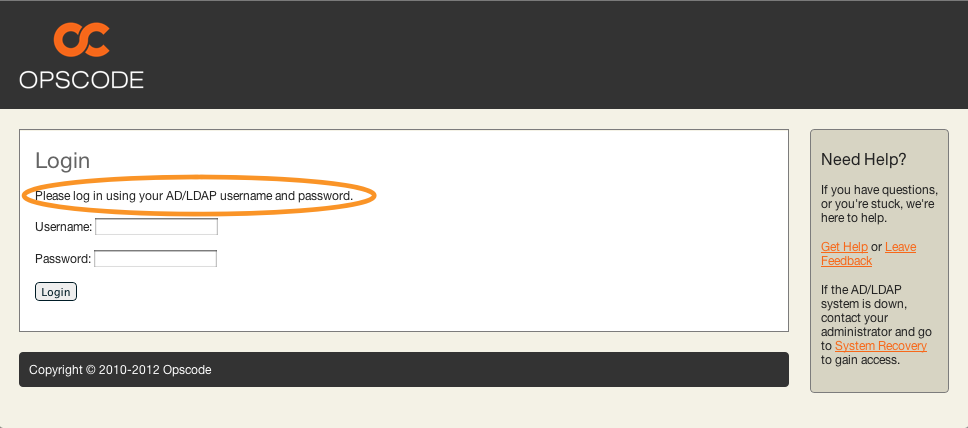
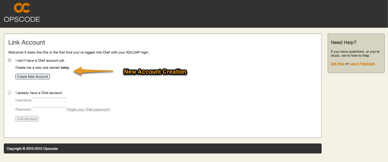
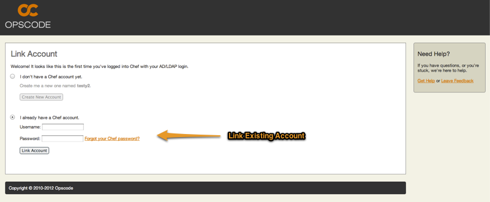
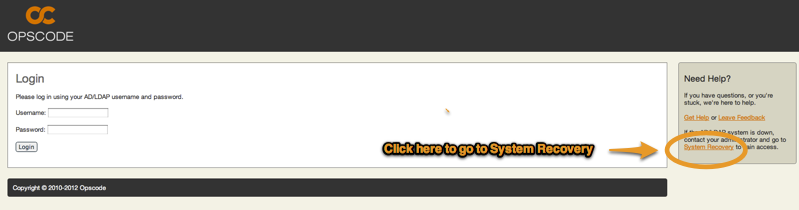
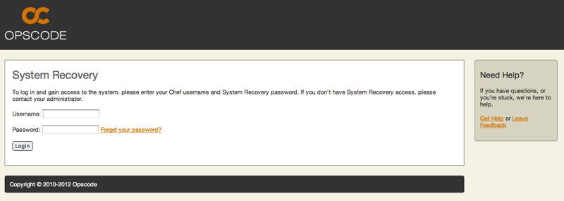

.. index::
  pair: configuration; private-chef.rb

=======================
Active Directory / LDAP
=======================

ATTN: Chef 12 is the  new Chef server! Please see the documentation at http://docs.getchef.com/server/. 

ATTN: The documentation for Private Chef has been moved to https://github.com/opscode/chef-docs and is published to http://docs.opscode.com/release/private_chef/index.html. This content is no longer actively maintained.

Private Chef supports Active Directory and LDAP authentication, allowing
users to log in using their corporate credentials instead of having a separate
Chef password.  To set this up, follow the instructions in the
:doc:`Active Directory / LDAP Installation </installation/ad_ldap>` section of this guide.

Logging in with Active Directory / LDAP
---------------------------------------

When Active Directory / LDAP is enabled, the login page will authenticate
users using their Active Directory credentials.

Users Logging In For The First Time
-----------------------------------

For users who have never logged into Chef before, they will simply log in using their
Active Directory / LDAP credentials. Once they log in they will be presented with a 
screen asking if they would like to create a new user with an
account name derived from their login name, or if they would like to
link their Active Directory / LDAP account to an existing Chef user account.

Once the user creates their new account they will be taken to the organization page, just as
any other user would upon logging in. The user will not be shown the link account page again,
now that their Active Directory / LDAP credentials are linked to a Chef account.

Existing Users Logging In After Turning On Active Directory / LDAP
------------------------------------------------------------------

If a user already has a Chef account prior to Active Directory / LDAP being setup, then the user
will initially login with their Active Directory / LDAP credentials. They will then be taken to the 
link account page and have the option of indicating that they already have a Chef account.

The user will put in their Chef account username and password. This will cause the account
to be linked to the user's Active Directory / LDAP credentials, so that when the user logs
on using their Active Directory / LDAP credentials they will be in their already existing
Chef account. The user will not be shown the link account page again.

Accessing Chef when Active Directory / LDAP is down
---------------------------------------------------

In the event that the Active Directory / LDAP server goes down or becomes unreachable
it is still possible for users to log into Chef provided they have a System Recovery 
password set on their Chef account.

To set or remove a System Recovery password for a user, see the instructions in the 
:ref:`private-chef-ctl password <private-chef-ctl-password>` section of this guide.

Once a user has a System Recovery password, they can log into the system by clicking the 
System Recovery Link found on the right hand side of the login page.

Once on the System Recovery Page, the user will be asked to enter their username and 
System Recovery password.

Once the user successfully logs in, they will gain access to the system and see the same 
screens as if Active Directory / LDAP were functioning.

If the user does not have System Recovery enabled for their account (even if they have 
a System Recover password set) they will be redirected to the login page and a message
will be shown stating that they do not have System Recovery enabled and to contact the 
system administrator.

