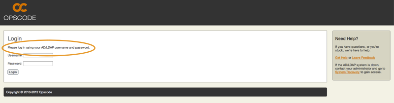

.. index::
  pair: configuration; private-chef.rb

=======================
Active Directory / LDAP
=======================

Private Chef supports Active Directory and LDAP authentication, allowing
users to log in using their corporate credentials instead of having a separate
Chef password.  To set this up, follow the instructions in the
:doc:`Active Directory / LDAP Installation </installation/ad_ldap>` section of this guide.

Logging in with Active Directory / LDAP
---------------------------------------

When Active Directory / LDAP is enabled, the login page will authenticate
users using their Active Directory credentials.

Users Logging In For The First Time
-----------------------------------

Users who have never used Chef before simply log in with their Active Directory
credentials, and Chef account is automatically created for them, populated with name and
email information from Active Directory / LDAP.

*Image: Created User*

Existing Users Logging In After Turning On Active Directory / LDAP
------------------------------------------------------------------

If a user owned a Chef account with a username and password before Active Directory
upgrade, Chef will notice this and ask them to enter the password for their old account.
After which the account will be "linked" and the user will still be a member of all their
organizations and retain all permissions.

*Image: Link Account*

Accessing Chef when Active Directory / LDAP is down
---------------------------------------------------

In the event that the Active Directory / LDAP server goes down or becomes unreachable
it is still possible for users to log into Chef provided they have a System Recovery 
password set on their Chef account.

To set or remove a System Recovery password for a user, see the instructions in the 
:ref:`private-chef-ctl password <private-chef-ctl-password>` section of this guide.

Once a user has a System Recovery password, they can log into the system by clicking the 
System Recovery Link found on the right hand side of the login page.

Once on the System Recovery Page, the user will be asked to enter their username and 
System Recovery password.

Once the user successfully logs in, they will gain access to the system and see the same 
screens as if Active Directory / LDAP was functioning.

If the user does not have System Recovery enabled for their account (even if they have 
a System Recover password set) they will be redirected to the login page and a message
will be shown stating they do not have System Recovery enabled and to contact the 
system administrator.

