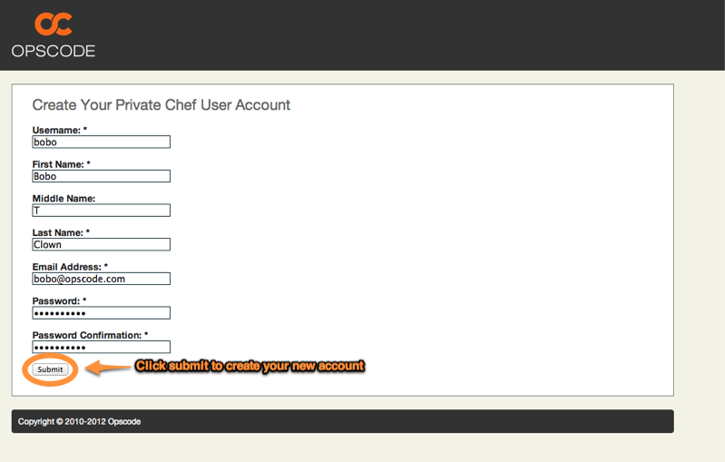

=============================
User Management
=============================
.. index::
  pair: user; creation

User Creation
-------------

Visiting the Private Chef management console will present you with a Login
page, which contains a *Sign Up* link: 

.. image:: ../images/signup.png

Enter your information on the signup page, and click *Submit*.

Once your user is created, you will have the opportunity to download your
private key - download it now.  This key is used for API access to Private
Chef. Private Chef does not keep a copy of this key, so please store it
somewhere safe.

.. image:: ../images/download_private_key.png
  :alt: Downloading your private key

User Profile
------------

From any point within the Management Console, you may visit your user profile
page. Just click your username in the upper right portion of the screen.

You will then be shown details about your account:

.. index::
  pair: user; password change
  pair: user; name change
  pair: user; email address change

Editing your User Profile
-------------------------

Clicking the *Edit* link on the user profile page will allow you to modify your user profile.

.. image:: ../images/user_profile_edit_link.png

From here you can change:

* Your first, middle, and last name.
* Email Address 
* Password

.. index::
  pair: user; regenerate private key 

Regenerating Your Private Key
-----------------------------

Each user account on a Private Chef server has a private key that allows them
API access to Private Chef. The Private Chef server does not store a copy of
this key. If you misplace this key, you will need to regenerate it in order to
restore API access for your user. You can regenerate this key from your user
profile page. You are not permitted to regenerate a key for a user account that
is not your own.

.. index::
  pair: user; password recovery

Password Recovery
-----------------

If you happen to forget or lose your Private Chef password, you can request a
password reset by clicking the *Forgot your password?* link on the login page
at any time. After entering your Private Chef username on the following page,
an email will be sent to you containing the link needed to reset your password.

