How Opscode Consulting Works
============================

Initial Engagement
------------------

You will be provided with access to a client-specific project portal, through
which we coordinate and share the progress on the scope of work, and where you
can ask questions of the Opscode staff.  In order to access the client portal,
you must provide Opscode the following information about your company:

*	Company Name
*	Mailing Address
*	Country
*	Time Zone (for the primary contact)
*	Web Address
*	Phone Number
*	Fax Number
*	Primary point of contact

Your primary point of contact should be empowered to make decisions on behalf
of the company regarding the work performed, and will be our point of contact
for any questions that come up during the engagement. Additionally, you may
provide up to 5 other individuals who can access the client portal. For each
individual, you must provide Opscode the following:

*	Full Name
*	Email
*	Title
*	Office Phone Number, including extension
*	Mobile Phone Number
*	Fax Number
*	Preferred Instant Messaging Name (on Skype, Google, or MSN)

This information should be sent via email to consulting@opscode.com.

Each point of contact will receive an email inviting them to join the Opscode
Client Portal, and will then have access to the project we’re using to manage
your Private Chef installation. Login information will be included in this
email.

Opscode will provide you with a Primary Consultant, who will be your primary
point of contact for the engagement, and a Secondary Consultant, who will be
available in the absence of the Primary Consultant. Opscode may assign new
consultants, either in addition to or in place of, those initially assigned.

Using the Project Portal
------------------------

Logging In
~~~~~~~~~~

To access the portal, open a web browser and navigate to:

http://opscode.basecamphq.com

You will be presented with a login screen similar to the following:

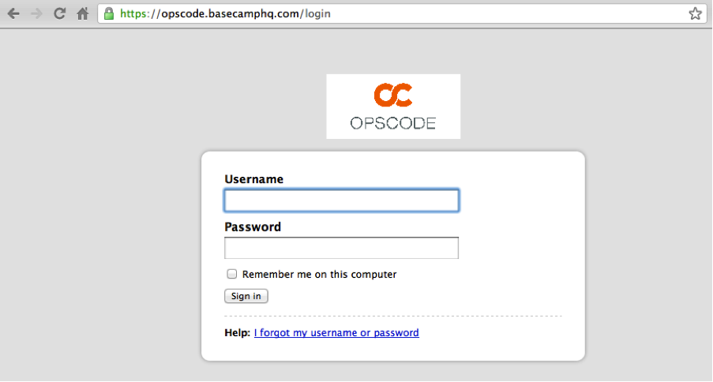

Input the Username and Password you created during the sign-up process.

Project Overview
~~~~~~~~~~~~~~~~

When you log in to your Project, you will first be taken to an overview screen.
This screen will present a history of recent activity on your project. It’s a
great way to see at a glance what’s new with your project.

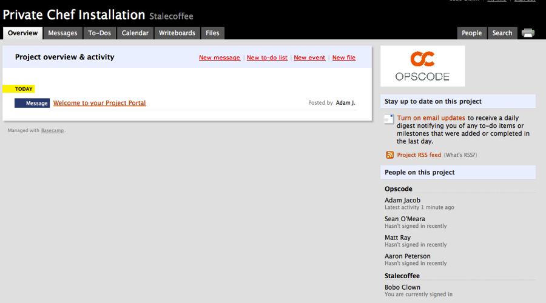

The most common activities listed will consist of Messages, To-Dos, and Writeboards.

Messages
~~~~~~~~

Messages are the primary means of communication between you and Opscode. If you
have a question for us, post a message to your project. Similarly, if we have
questions for you, status updates, or other information to share, we will be
posting them as messages for you. The use of Messages is highly preferred to
emailing your consultants directly - it allows us to ensure that everyone
involved in providing your services knows what is happening, and provides you a
record of events should you need to review.

If you do send consultants email directly, they will post it as a message to
your client portal, to ensure it is cataloged for posterity.

To send us a message:

1. Click the “Messages” tab

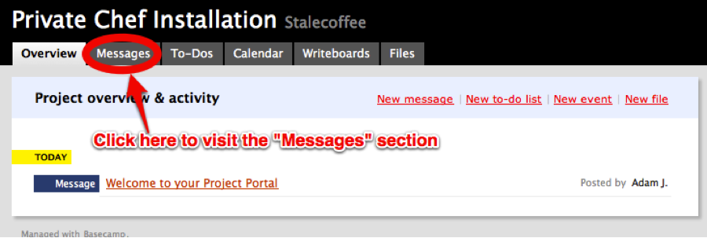

2. Click “Post a new Message”

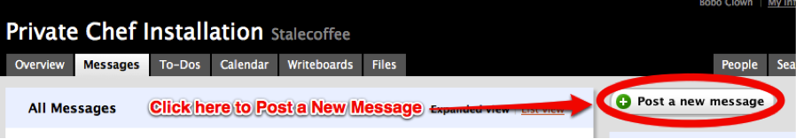

3. Fill in the message Title and Body. Our consultants are notified
   automatically, but if the message is urgent, feel free to notify them via
   Email as well by clicking next to their name.

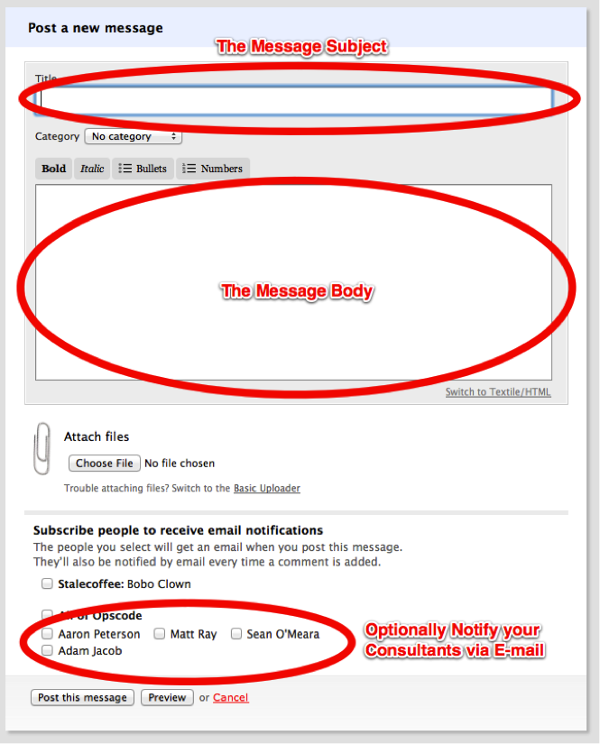

4.	Click "Post this message"

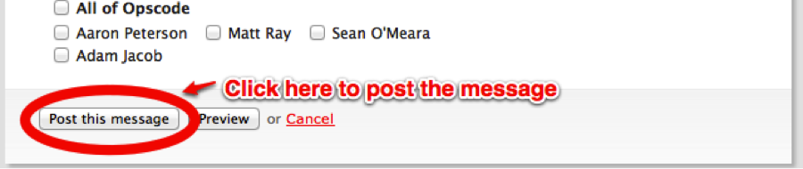

To-Dos
~~~~~~

Each phase of the project will have one or more To-Do lists created, which are
used to track deliverables (both from Opscode to You, and from You to Opscode.)
As each task is performed, it will be crossed off the list - To-Do lists are a
great way to see, at a glance, how the work on your project is going, and how
much work remains.

Most often, you will be accessing the To-Do tab to either review a particular
phases status, or to cross off a To-Do item yourself.

To access the To-Do lists:

1. Click the “To-Dos” tab.

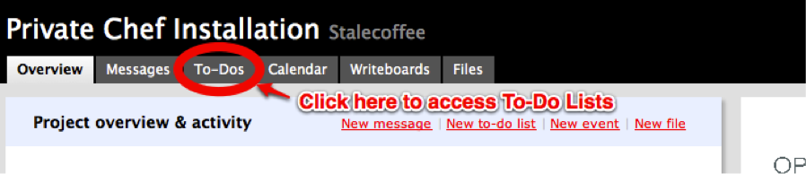

2. From here, you can easily view all of the active To-Do lists. To cross off
   an item, simply click the checkbox.

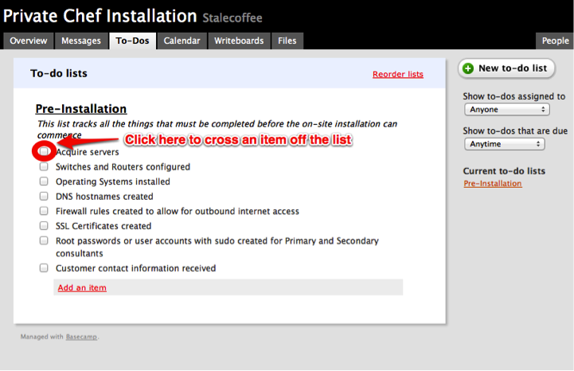

Writeboards
~~~~~~~~~~~

Writeboards provide a collaborative workspace for editing documents. In many
cases, Opscode uses them to provide a starting place for customer requirements
or prerequisites. As we learn more about the environment, we will
collaboratively edit the Writeboard to update it with the most relevant data.

For example, on Private Chef Installation engagements, a Writeboard is created
to track any changes to Server Specifications, and to keep notes during the
engagement.

To access a Writeboard:

1. Click the “Writeboards” tab.

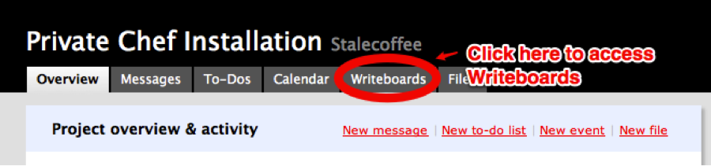

2. Select the Writeboard you wish to view or edit.

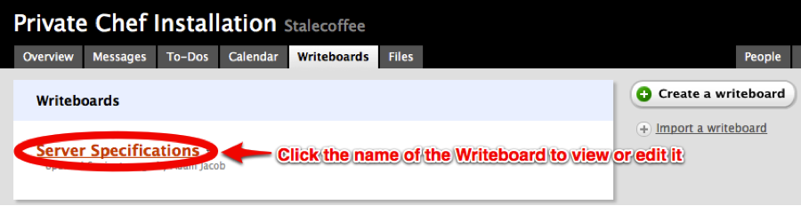

3. Once viewing the Writeboard, you can click the “Edit this page” button to
   edit, or simply scroll to view the document.

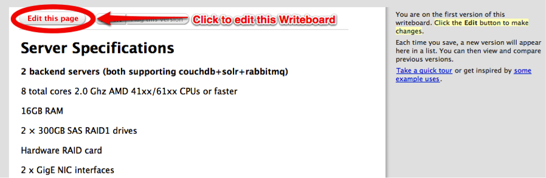

During the Engagement
---------------------

As work progresses on your project, we will be keeping in touch via the Project
Portal. As tasks are completed, we will be checking them off the relevant To-Do
lists, and we will be posting a summary status message for each day that work
occurs on your project, reviewing the progress that day.

If you have questions about the project, please post a message to the portal.

When the Engagement is finished
-------------------------------

When the engagement is finished, we will post any final deliverables to your
project portal and will schedule an acceptance meeting. In this meeting, we
will review the acceptance criteria for your project, and ensure that you are
satisfied with results. When both you and Opscode have signed off on the
acceptance criteria, the engagement is complete.

In addition to the acceptance meeting, we will schedule a short customer
satisfaction meeting to review your experience with Opscode Consulting. We
encourage you to be as candid as possible - only through understanding your
experience can we ensure the quality of our work, both for your company and
those we engage with in the future.

