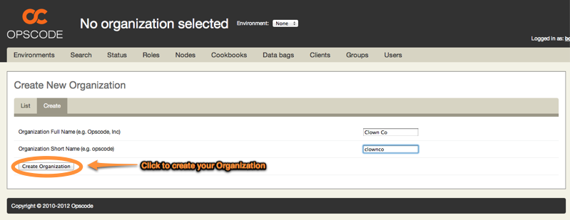
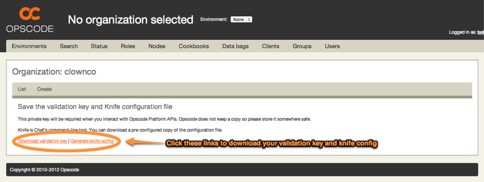

=============================
Initial Organization Creation
=============================

In order to being managing infrastructure with Private Chef, you will need to
create an Organization. Organizations are totally multi-tenant Chef
infrastructures that share nothing with other organizations on your Private
Chef server.

.. image:: click_to_create_org.png

You will then be prompted to fill in a form with two fields:

- **Organization Full Name**: Should be the name of your company or department
- **Organizaiton Short Name**: Should be a lowercase word describing the organization - used in the Web UI and API URLs.

Once you have filled in the for, click *Create Organization* to create your organization.

Once the organization is created, you need to:

- **Download the validation key**: This key will enable you to attach clients to this Private Chef organization
- **Generate a knife configuration file**: Knife is the command line API to Chef, and this link will provide you with a pre-generated configuration for this organization, and customized for your Private Chef installation.

