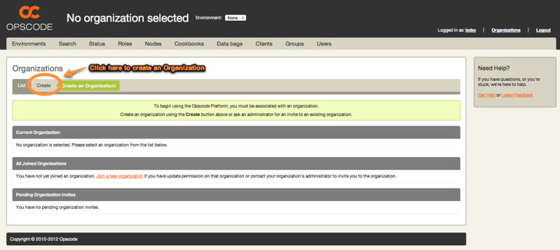

=============================
Initial Organization Creation
=============================

ATTN: Chef 12 is the  new Chef server! Please see the documentation at http://docs.getchef.com/server/. 

ATTN: The documentation for Private Chef has been moved to https://github.com/opscode/chef-docs and is published to http://docs.opscode.com/release/private_chef/index.html. This content is no longer actively maintained.

In order to begin managing your infrastructure with Private Chef, you will need to
create an Organization. Organizations are completely multi-tenant Chef
infrastructures that share nothing with other organizations on your Private
Chef server.

You will then be prompted to fill in a form with two fields:

- **Organization Full Name**: Should be the name of your company or department
- **Organization Short Name**: Should be a lowercase word describing the organization - used in the Web UI and API URLs.

Once you have filled in the form, click *Create Organization* to create your organization.

.. image:: ../images/create_org_button.png

Once the organization is created, you need to:

- **Download the validation key**: This key will enable you to attach clients to this Private Chef organization
- **Generate a knife configuration file**: Knife is the command line API to Chef, and this link will provide you with a pre-generated configuration for this organization, and customized for your Private Chef installation.

.. image:: ../images/download_key_and_knife.png

