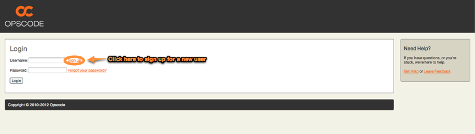
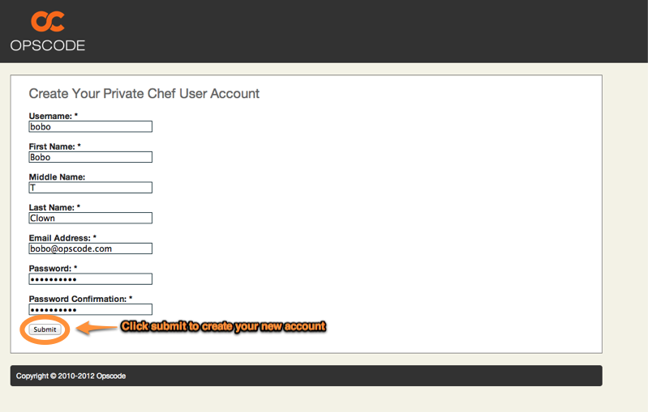
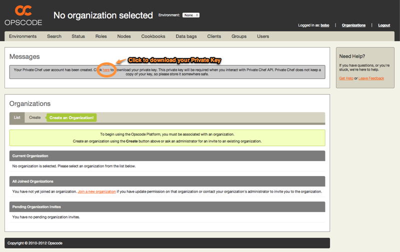

=======================
Initial User Creation
=======================

You must create a new user account before using Private Chef.

.. note::

  If your server is in Active Directory/LDAP mode, signup is unnecessary and
  you can simply log in to Chef using your credentials.

Visiting the Private Chef management console will present you with a Login
page, which contains a *Sign Up* link: 

Enter your information on the signup page, and click *Submit*.

Once your user is created, you will have the opportunity to download your
private key - download it now.  This key is used for API access to Private
Chef. Private Chef does not keep a copy of this key, so please store it
somewhere safe.

=======================
Initial Organization Creation
=======================

If you are following along with a private chef installation and have not done so already, now is a good time to create an
organization :doc:`Organization Creation </installation/org_creation>`
